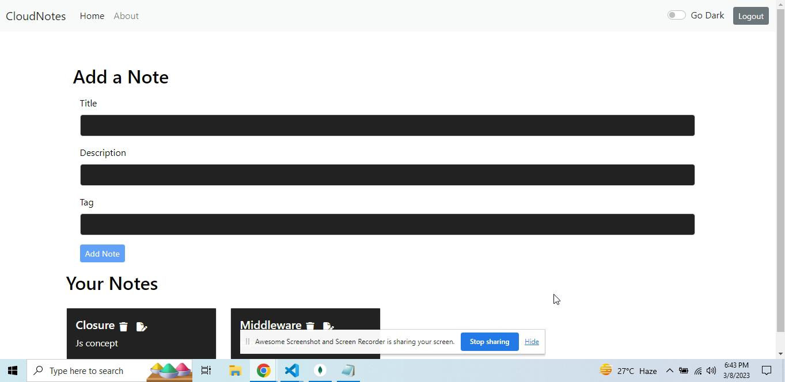

# Project - CloudNotes Frontened

## Make sure to check Backend Repository :  
https://github.com/insh007/CloudNotes-Backend

## Deploy Link :

## Overview
CloudNotes is a tool that allows users to securely store their notes on the cloud, and that it provides them with the ability to manage and organize their notes in a convenient and efficient way.
So the app eliminates the need for users to keep track of physical notebooks or sticky notes, or that it allows them to access their notes from anywhere with an internet connection.
CloudNotes is a web app built with the MERN (MongoDB, Express, React, Node.js) stack that allows users to create, view, update, and delete notes online. The app provides a simple and intuitive interface, with a navbar that includes Home, About, Login, Sign Up, and Logout options.
The authentication and authorization system ensures that each user can only access their own notes, or the ability to perform read, update, and delete operations on notes.

## Installation and Setup
1. Clone the repository to your local machine.
2. Run npm install to install the dependencies.
3. Run npm start to start the app.

## Usage
1. Navigate to the Home page using the navbar if you have registerd otherwise need to registered first.
2. Fill out the form with a title, description, and tag for your note.
3. Click the "Create" button to save your note.
4. Your note will be displayed in a Bootstrap card below the form.
5. To update a note, click the "Update" icon on the card and modify the form.
6. To delete a note, click the "Delete" icon on the card.

## Technologies Used
1. MongoDB: a NoSQL database used for storing and retrieving data
2. Express.js: a web application framework for Node.js
3. React: a JavaScript library for building user interfaces
4. Node.js: a JavaScript runtime environment for running server-side code
5. Bootstrap: a CSS framework for building responsive web pages

## About
The About section of the app provides information about the purpose and features of CloudNotes. It includes a Bootstrap Accordion with details about the app, as well as a Login form and a Sign Up form.

The Login form requires an email and password to authenticate users. The Sign Up form requires a name, email, password, and confirmation of the password. The app includes proper alerts to handle everything going on in the app.

## Screenshots
The following screenshots provide a visual representation of the app:

###### Home Page Dark Mode

 
 
 

###### Home Page Light Mode

 
 
 

###### About Page Dark Mode

 
 
 

###### About Page Light Mode

 
 
 

###### Login Page Dark Mode

 
 
 

###### Login Page Light Mode

 
 
 

###### SignUp Page Dark Mode

 
 
 

###### SignUp Page Light Mode

 

## Credits
This project uses several open-source libraries and tools:

1. React
2. Node.js
3. Express.js
4. Bootstrap